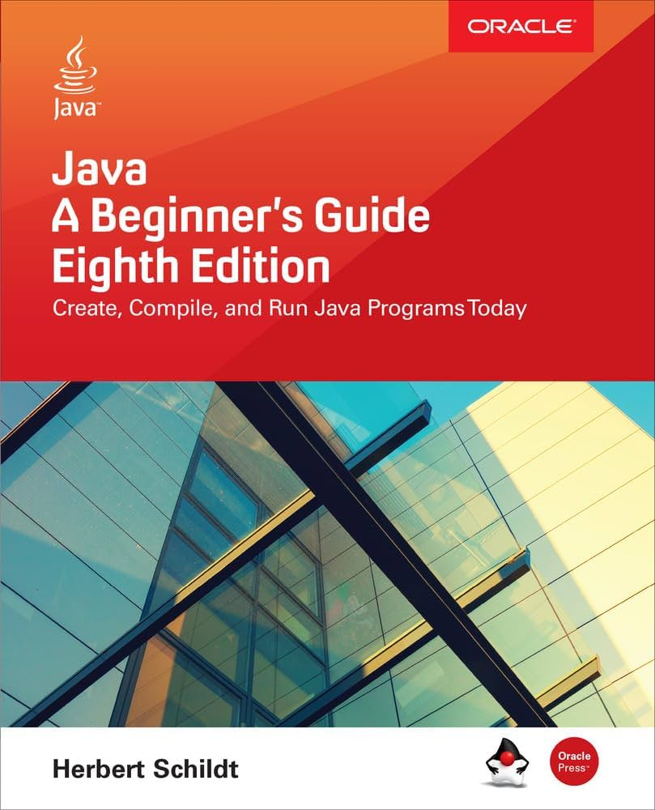

# ThreadsCreator

Java program simulating thread execution in Operating Systems

## Jobs
- Creating child-threads
- Terminating threads

Inside `main()` a new **Thread** object is created by following sequence :

```java
		MyThread mt = new MyThread("Child #1");
		
		Thread newThrd = new Thread(mt);
		
		newThrd.start();
```

### Source
Code examples adapted from "Java: The Complete Reference" 
by Herbert Schildt (McGraw-Hill).

<p align="center">
<a href="https://www.mheducation.com/highered/mhp/product/java-complete-reference-tenth-edition.html?viewOption=student">

</a>
</p>


#### Purpose
For educational and personal learning purposes only.